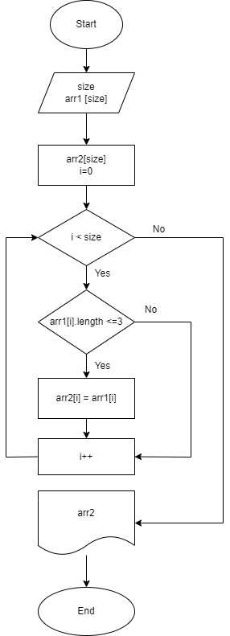

# Программа, которая из имеющегося массива строк формирует новый массив из строк, длина которых меньше, либо равна 3 символам. 
## Блок-схема алгоритма: 

Данная программа позволяет ввести с клавиатуры исходный размер массива и заполнить его.
Затем из имеющегося массива формируется новый массив с элементами, длина которых меньше, либо равно 3 символам.
Программа состоит из трех методов и основной части.
1. Метод CreateArrayString.
Данный метод создает массив строк, предлагая пользователю ввести сначала размер данного массива, а затем каждый его элемент.
2. Метод PrintArray.
Данный метод выводит в консоль массив, переданный в качестве аргумента.
3. Метод CopyArray.
Данный метод копирует элементы длиной не более 3 символов из массива переданного в качестве аргумента, в новый массив.